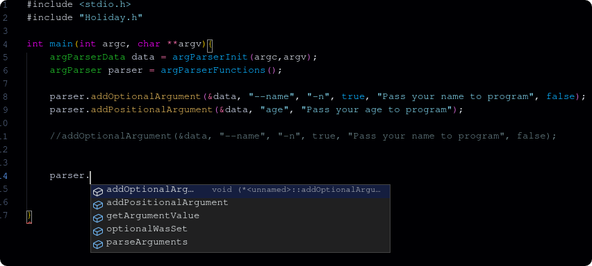

<div align="center">
    <h1>Holiday</h1>
    
    <p>Written by Cipher</p>
</div>


## What's that
Holiday is an argument parser for C programming language, this support optional arguments, positional arguments and some salt in each one. The library is not complex to use and is just one file, header only.

## Cross-platform
This lib only use C standard libraries in its includes then you can use it on any platform. These is the used C standard libs;
<ul>
    <li>malloc.h</li>
    <li>string.h</li>
    <li>stdlib.h</li>
    <li>stdbool.h</li>
    <li>ctype.h</li>
</ul>

## Optional arguments
As the name say, optional arguments don't need necessary be pass, and the program can run even without it. But with Holiday you can make them required if necessary. Optional argument don't interfere in any positional argument in CLI command. It's identified by flags that start with '--' or '-'.

## Positional arguments
Positional arguments is always required in program call, without it a crash is given. The order of required positional arguments in the C code is the order that need be pass in CLI program call. Positional argument is identified just by a name, but this name is only visible by the programmer.


## How to use
The Holiday has two ways to use, one using the default C functional way and another that try reach an OOP format.

### Including the Holiday
Just download the file "Holiday.h" from the Holiday folder in file tree and include the file by just typing it on the first line of program.
```c
#include "Holiday.h"
```

### Using in functional way
After including it you need to initialize a struct that will store all information about the Holiday, it need two arguments, argc and argv.

```c
argParserData data = argParserInit(argc,argv);
```
after initializing the argParserData struct you can start programming the required arguments in your program. You have two ways, the optional argument and the positional argument.

Optional way
```c
// addOptionalArgument(<argParserData>, <long argument name>, <short argument name>, <if need value>, <a help that will showed if the user get stuck>>, <if this optional argument is required>);

addOptionalArgument(&data, "--name", "-n", true, "Pass your name to program", false);
```

### Optional way warnings !!!

The lib will always fix the full optional name or short optional name if them are wrong, like pass just "name" to full optional name, that should be "--name". Following this same idea, the name of short optional flag will be changed if already has a short flag with this name, it will change the case, and if even the case changed already has a flag with this name, a random character will be picked up, and if it fail again, a message is given on terminal and a exit(1) is called. The lib can't do it with full optional name, because this, if two full optional names are the same, a message is given on terminal and a exit(1) is called.

addPositionArgument function has a min/max size for full optional name and short optional name, and the program crash if not followed. The min size of full optional name is 2 characters beyond "--", and the min size of short optional name is 1, that is the same value for the max value. If the program crash, a log will be given to you know what happened.

Positional way
```c
// addPositionalArgument(<argParserData>, <identifier>, <a help that will showed if the user get stuck>);

addPositionalArgument(&data, "age", "Pass your age to program");
```

### Positional way warnings !!!

Like in optional way, here the lib will always try fix some argument that you required for your program, like require "--name" that should be just "name" in this feature. Positional arguments need a min value, anything greater than 0 is good. Characters like "-" doesn't count if they are in string begin.

Parsing
```c
// parseArguments(<argParserData>, <if can exit program if something that the user typed is wrong>);

// If something wrong, the lib will print a help message in terminal

parseArguments(&data, true);
```

Checking if an optional argument was triggered
```c
// optionalWasSet(<argParserData>, <flag to check>);

// This return a boolean
optionalWasSet(data, "-n");
```

Getting a value from arguments
```c
// getArgumentValue(<argParserData>, <flag to get>);


// This function return a string
getArgumentValue(&data, "--name");
```

This is a functional program with this library, using all functions above
```c
#include <stdio.h>
#include "Holiday.h"

int main(int argc, char **argv){
    argParserData data = argParserInit(argc,argv);

    addOptionalArgument(&data, "--name", "-n", true, "Pass your name to program", false);
    addPositionalArgument(&data, "age", "Pass your age to program");
    
    parseArguments(&data, true);


    if(optionalWasSet(data, "-n")){
        printf("Your name is: %s\n", getArgumentValue(&data, "-n"));
    }
    else{
        printf("Your name i don't know, but ");
    }

    printf("your age is %s\n", getArgumentValue(&data, "age"));

    return 0;
}
```

Inputs / Outputs
```sh
./main 23 --name "Roberto"

Your name is: Roberto
your age is 23


./main --name "Carlinhos" 43

Your name is: Carlinhos
your age is 43


./main 18

Your name i dont know, but your age is 18
```

## Struct as a class
If you don't like the functions that is spread around the code, you can use it from a struct, the function argParserFunctions() do it very well, and return a struct of type argParser.

```c
argParserData data = argParserInit(argc,argv);
argParser parser = argParserFunctions();
```
after it all functions that can be used of library is available in that struct, some editors can show your symbols as a variable in intellisense, but all of them is callable.


